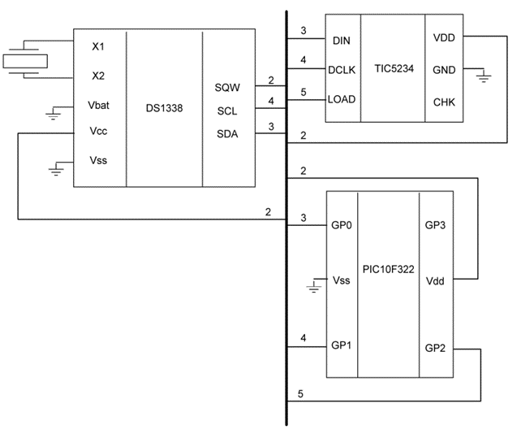
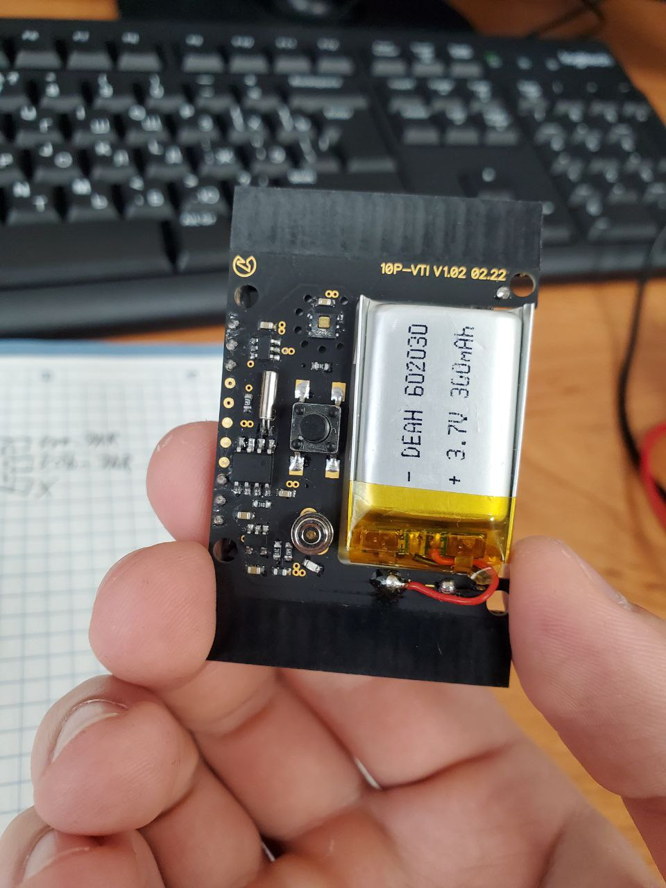

# Автономные часы на микроконтроллере PIC10F322

## Описание проекта

Проект представляет собой разработку прошивки для автономных часов на базе микроконтроллера PIC10F322. Устройство отображает текущее время на специализированном LCD-дисплее и использует часы реального времени DS1338 для ведения точного времени.

## Структура проекта

```
├── src/
│   ├── main.asm              # Основной файл прошивки
│   ├── init.inc              # Макросы инициализации
│   ├── lcd.inc               # Управление LCD дисплеем
│   └── i2c.inc               # Протокол I2C для RTC
└── README.md
```

## Компоненты системы

### Основные компоненты
- **Микроконтроллер**: PIC10F322
- **Дисплей**: LCD TIC5234 (специализированный сегментный дисплей)
- **RTC модуль**: DS1338 (часы реального времени)
- **Интерфейс**: I2C для связи с RTC

## Схема подключения




## Особенности реализации

### Архитектура программы

1. **Инициализация системы**
   - Настройка портов ввода/вывода
   - Конфигурация внутреннего генератора (4MHz)
   - Инициализация I2C интерфейса
   - Настройка LCD дисплея

2. **Основной цикл**
   - Чтение времени из RTC DS1338
   - Обработка и форматирование данных
   - Вывод на LCD дисплей
   - Пауза перед следующим циклом

### Управление LCD дисплеем

Дисплей TIC5234 имеет специфичную сегментную структуру, требующую индивидуальные шаблоны для каждой цифры (из за этого проблемы и нехватка памяти МК):


### I2C протокол для RTC

Реализованы основные операции I2C:
- START и STOP условия
- Передача и прием байтов
- Обработка ACK/NACK сигналов

## Технические сложности

### Работа с документацией (Datasheets)

При разработке возникли сложности с интерпретацией технической документации:

1. **PIC10F322**: Ограниченная память программ (512 слов) требовала оптимизации кода
2. **TIC5234**: Отсутствие подробного описания сегментной разметки потребовало экспериментального определения паттернов
3. **DS1338**: Специфичный формат данных времени в BCD формате

### Оптимизация ресурсов

- Использование макросов для экономии памяти программ
- Переиспользование регистров общего назначения
- Минимизация количества подпрограмм

## Пример работы

<div align="center">
  
</div>




## Конфигурация микроконтроллера

```assembly
__CONFIG _FOSC_INTOSC & _BOREN_ON & _WDTE_OFF & _PWRTE_ON & _MCLRE_OFF & _CP_OFF & _LVP_OFF & _LPBOR_ON & _BORV_LO & _WRT_OFF
```

- Внутренний тактовый генератор
- Защита от просадки питания включена
- Сторожевой таймер отключен
- Задержка включения питания включена

## Сборка и прошивка

### Требуемые инструменты:
- MPLAB IDE
- MPASM ассемблер
- Программатор для PIC микроконтроллеров

### Процесс сборки:
1. Открыть проект в MPLAB IDE
2. Выбрать целевое устройство: PIC10F322
3. Собрать проект (Build)
4. Прошить микроконтроллер полученным HEX файлом

## Файловая структура кода

- `main.asm` - основная логика программы
- `init.inc` - макросы инициализации портов и периферии
- `lcd.inc` - управление LCD дисплеем и паттерны цифр
- `i2c.inc` - реализация протокола I2C для связи с RTC

---

Проект демонстрирует навыки низкоуровневого программирования микроконтроллеров, работы с аппаратными интерфейсами и оптимизации кода для ограниченных ресурсов.